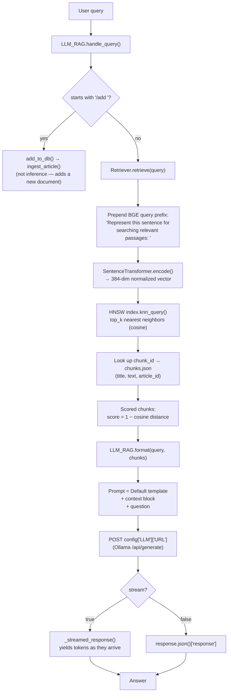

# Wikipedia RAG Pipeline (from scratch)

A Retrieval-Augmented Generation pipeline built module-by-module over a static Wikipedia
corpus, with no vector-DB dependency and no framework (no LangChain/LlamaIndex). Every
stage — chunking, embedding, ANN indexing, retrieval, and prompt assembly — is implemented
directly rather than delegated to a library.

```
Wikipedia (streamed) → clean/dedupe → chunk → embed → HNSW index → retrieve → Ollama generate
```

---

## Stack

| Concern            | Choice                                                        |
|--------------------|----------------------------------------------------------------|
| Embeddings         | `BAAI/bge-small-en-v1.5` (384-dim, CPU-friendly, BGE query prefixing) |
| Vector index       | `hnswlib`, `space=cosine`, `M=16`, `ef_construction=200`       |
| Storage            | `numpy .npy` for vectors, `JSON` for chunk metadata (no vector DB) |
| Generation         | Ollama (`qwen3:1.7b` by default), called via raw `requests`    |
| Config             | `config.yaml` — single source of truth for paths & hyperparams |
| Paths              | `pathlib` throughout                                           |

---

## Project layout

```
.
├── config.yaml               # all paths, hyperparameters, prompts
├── requirements.txt           # Python dependencies
├── chunking.py                # text → overlapping chunks
├── Embedding.py               # chunks → embedding matrix (.npy)
├── hnsw.py                    # embeddings → HNSW index (build / update)
├── ingest.py                  # single-document live ingestion (chunk+embed+index in one call)
├── generation.py              # Retriever + Ollama wrapper, query entry point
├── Datasets/
│   ├── load_ds.py             # streams & cleans Wikipedia articles
│   ├── wiki_articles.json     # (generated) cleaned article corpus
│   ├── chunks.json            # (generated) chunk metadata
│   └── embeddings.npy         # (generated) embedding matrix
└── Retrieval/
    ├── Retrieve.py             # Retriever class (embed query → knn search)
    └── hnsw_index.bin          # (generated) serialized HNSW index
```

---

## Query time: inference flow

At query time, the index is static (precomputed offline). Only `Retrieve.py` and `generation.py`
are on the hot path:



The `Retriever` and its underlying model/index are loaded once at `LLM_RAG.__init__` and
reused across every query in the session — nothing on this path re-reads `chunks.json`,
re-embeds, or reloads the index per call.

---

## Build time: pipeline stages

### 1. `Datasets/load_ds.py` — corpus acquisition
Streams `wikimedia/wikipedia` (`20231101.en`), strips `[n]` reference markers and
`== Header ==` markup, collapses whitespace, drops stubs under `MIN_WORDS`, and
deduplicates via an MD5 hash of each article's first 200 characters. Re-running the script
loads the existing `wiki_articles.json`, continues `id` numbering from the max existing id,
and only appends genuinely new articles.

```bash
python Datasets/load_ds.py
```

### 2. `chunking.py` — recursive chunking
Splits each article using a separator hierarchy (`\n\n → \n → sentence → clause → word`),
falling back to a hard word-count split if no separator remains. Pieces are greedily packed
up to `Chunk size` words, then merged chunks get `Overlap` words of context copied from the
tail of the previous chunk. `chunking.py` owns `chunks.json` exclusively, and only processes
articles not already represented (diffed by `article_id`).

```bash
python chunking.py
```

### 3. `Embedding.py` — embedding
Loads `chunks.json`, diffs chunk count against existing `embeddings.npy` row count, and
embeds only the new tail. Uses BGE's symmetric passage embedding (no query prefix — that's
added at retrieval time), batched, L2-normalized, `float32`.

```bash
python Embedding.py
```

### 4. `hnsw.py` — indexing
Two entry points, dispatched by `__main__` based on whether `hnsw_index.bin` exists:

- **`build_tree()`** — fresh build from all embeddings. Allocates `max_elements = 2×N` for
  headroom, and writes `number of elements` and `dim` back to `config.yaml`.
- **`update(index)`** — incremental. Uses `index.get_current_count()` as the diff point
  against the embeddings array, resizes the index if the new total would exceed
  `max_elements`, and appends only the new vectors. Also persists the new count to config.

```bash
python hnsw.py
```

A third helper, **`add_single(index, new_embedding)`**, adds a batch of vectors to an
already-loaded index in memory — used by `ingest.py`'s live path rather than the batch
dispatcher above.

### 5. `Retrieval/Retrieve.py` — retrieval
`Retriever` loads the SentenceTransformer model and the HNSW index once in `__init__`, then
applies the BGE asymmetric query prefix
(`"Represent this sentence for searching relevant passages: "`) before encoding and running
a `knn_query`. Returns the top-k chunks with cosine distance converted into a `[0, 1]`
similarity score.

### 6. `generation.py` — generation layer
`LLM_RAG` wraps a `Retriever` and an Ollama endpoint (raw `requests.post`, config-driven
model/URL). `generate()` retrieves context, builds a prompt via `format()`, and posts to
Ollama, with a `_streamed_response` generator for token-by-token output when `stream=True`.
`handle_query()` is the single entry point: a `/add <text>` prefix routes to `add_to_db()`,
which has the LLM reformat raw text into an encyclopedia-style article and hands it to
`ingest_article()`; anything else is treated as a normal RAG query.

```bash
python generation.py
```

### 7. `ingest.py` — live single-document ingestion
The "add one document without a full batch rebuild" path: `add_article` → `chunk_new_article`
→ `embed` → `hnsw.add_single`, then persists the updated element count to `config.yaml`.
This is what `generation.py`'s `/add` command calls under the hood.

---

## Design principle: append-only, everywhere

`chunks.json`, `embeddings.npy`, and the HNSW index are three separate artifacts that stay
aligned by row position. Every stage diffs against its own downstream artifact and only
processes what's new:

- `chunking.py` diffs by `article_id` already present in `chunks.json`
- `Embedding.py` diffs chunk count vs. `embeddings.npy` row count
- `hnsw.update()` diffs via `index.get_current_count()`

Chunk-writing is owned exclusively by `chunking.py`, so alignment across all three artifacts
is guaranteed by construction rather than by a post-hoc check.

---

## Setup

```bash
pip install -r requirements.txt
```

Generation also requires a local [Ollama](https://ollama.com) install with the configured
model pulled:

```bash
ollama pull qwen3:1.7b
```

Run the batch pipeline in order the first time:

```bash
python Datasets/load_ds.py
python chunking.py
python Embedding.py
python hnsw.py
python generation.py
```

Re-running any of the first four scripts is incremental — each only processes what's new
since the last run, so the same commands double as the update workflow.

---

## Config reference (`config.yaml`)

| Key | Meaning |
|---|---|
| `Chunking.Chunk size` / `Overlap` | Word counts, not tokens |
| `Embedding.Model` / `Batch` | SentenceTransformer model id, batch size |
| `HNSW.Distance Metric` | `cosine` / `l2` / `ip` |
| `HNSW.Max Edges` | HNSW `M` parameter |
| `HNSW.EF_construct` / `EF_search` | Build-time vs. query-time `ef` |
| `HNSW.number of elements` / `dim` | Kept in sync automatically by `hnsw.py` / `ingest.py` |
| `HNSW.top_k` | Default retrieval count |
| `LLM.Model` / `URL` / `Prompts` | Ollama model name, endpoint, prompt templates |


